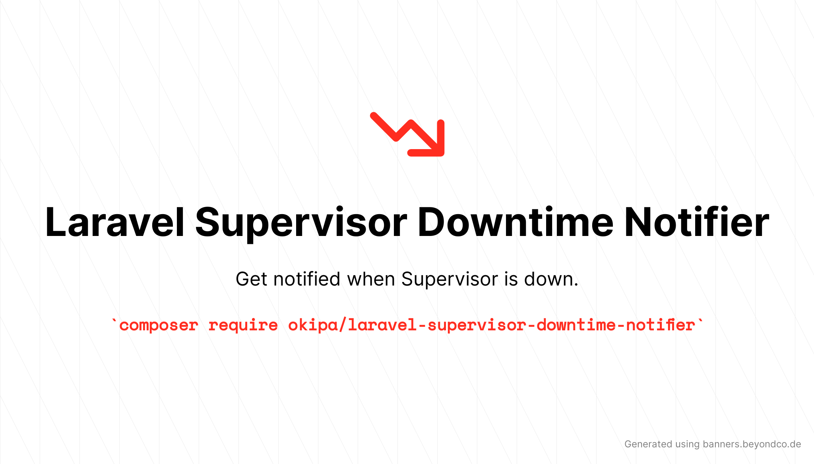

<p align="center">
    <a href="https://github.com/Okipa/laravel-supervisor-downtime-notifier/releases" title="Latest Stable Version">
        
    </a>
    <a href="https://packagist.org/packages/Okipa/laravel-supervisor-downtime-notifier" title="Total Downloads">
        
    </a>
    <a href="https://github.com/Okipa/laravel-supervisor-downtime-notifier/actions" title="Build Status">
        
    </a>
    <a href="https://coveralls.io/github/Okipa/laravel-supervisor-downtime-notifier?branch=master" title="Coverage Status">
        
    </a>
    <a href="https://img.shields.io/badge/License-MIT-blue.svg" title="License: MIT">
        
    </a>
</p>

Get notified and execute PHP callback when:
* The supervisor service is not running on your server
* Your environment supervisor processes are down
  
Notifications can be sent by mail, Slack and webhooks (chats often provide a webhook API).

## Compatibility

| Laravel version | PHP version | Package version |
|---|---|---|
| ^7.0 | ^7.4 | ^2.0 |
| ^6.0 | ^7.4 | ^1.0 |

## Upgrade guide

* [From v1 to V2](/docs/upgrade-guides/from-v1-to-v2.md)

## Table of Contents
* [Requirements](#requirements)
* [Installation](#installation)
* [Configuration](#configuration)
* [Translations](#translations)
* [Usage](#usage)
* [Testing](#testing)
* [Changelog](#changelog)
* [Contributing](#contributing)
* [Credits](#credits)
* [Licence](#license)

## Requirements

By default, this package monitors supervisor downtime for projects running on Linux servers.

The user running PHP CLI will execute the following commands:

* `systemctl is-active supervisor`
* `supervisorctl status "<your-process-name>"`

As so, make sure you give him permission to execute these actions (`sudo visudo -f /etc/sudoers.d/<user>`):

* `<user> ALL=NOPASSWD:/bin/systemctl is-active supervisor`
* `<user> ALL=NOPASSWD:/usr/bin/supervisorctl status *`

That being said, you still can use this package for other servers OS by using your own `SupervisorChecker` class and defining OS-specific commands.

## Installation

Install the package with composer:

```bash
composer require okipa/laravel-supervisor-downtime-notifier
```

If you intend to send `Slack` notifications you will have to install:

* https://github.com/laravel/slack-notification-channel

```bash
composer require laravel/slack-notification-channel
```

If you intend to send `webhook` notifications you will have to install:

* https://github.com/laravel-notification-channels/webhook

```bash
composer require laravel-notification-channels/webhook
```

## Configuration
  
Publish the package configuration: 

```bash
php artisan vendor:publish --tag=supervisor-downtime-notifier:config
```

## Translations

All words and sentences used in this package are translatable.

See how to translate them on the Laravel official documentation: https://laravel.com/docs/localization#using-translation-strings-as-keys.

Here is the list of the words and sentences available for translation by default:

```text
* [:app - :env] supervisor service is not started
* We have detected that the supervisor service is not started on [:app - :env](:url).
* `[:app - :env]` supervisor service is not started on :url.
* Supervisor service is not started.
* {1}[:app - :env] :count supervisor down process has been detected|[2,*][:app - :env] :count supervisor down processes have been detected
* {1}We have detected :count supervisor down process on [:app - :env](:url): ":processes".|[2,*]We have detected :count supervisor down processes on [:app - :env](:url): ":processes".
* Please check your down processes connecting to your server and executing the "supervisorctl status" command.
* {1}`[:app - :env]` :count supervisor down process has been detected on :url: ":processes".|[2,*]`[:app - :env]` :count supervisor down processes have been detected on :url: ":processes".
* {1}:count supervisor down process has been detected: ":processes".|[2,*]:count supervisor down processes have been detected: ":processes".
* Notification test:
* Exception test:
```

## Usage

Just add this command in the `schedule()` method of your `\App\Console\Kernel` class:

```php
$schedule->command('supervisor:downtime:notify')->everyFifteenMinutes();
```

And you will be notified if your supervisor service is not running, or if your environment supervisor processes are down when the command will be executed.

Once everything has been set up, you can check if the configuration is correct by simulating supervisor processes downtime:

```bash
php artisan supervisor:downtime:simulate
```

## Testing

```bash
composer test
```

## Changelog

Please see [CHANGELOG](CHANGELOG.md) for more information what has changed recently.

## Contributing

Please see [CONTRIBUTING](CONTRIBUTING.md) for details.

## Credits

* [Arthur LORENT](https://github.com/okipa)
* [All Contributors](../../contributors)

## License

The MIT License (MIT). Please see [License File](LICENSE.md) for more information.
